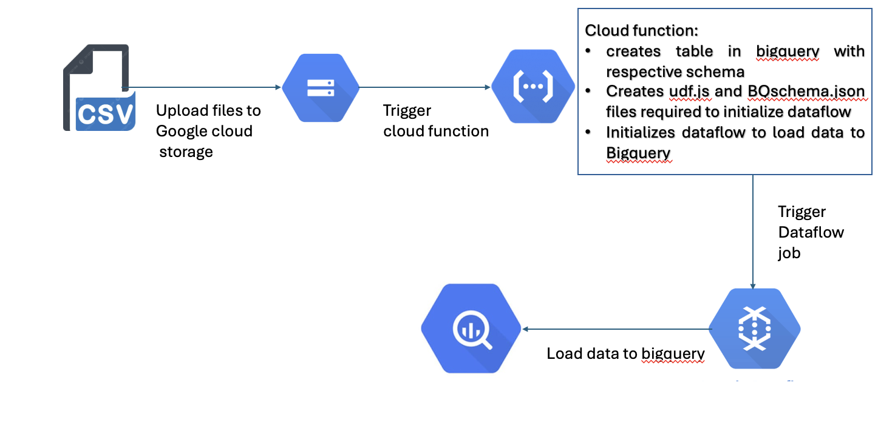
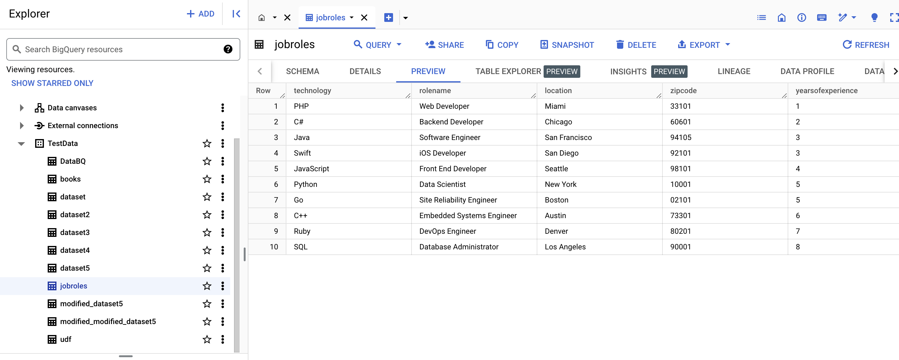
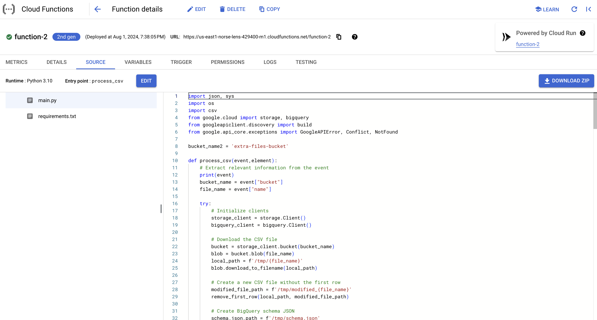
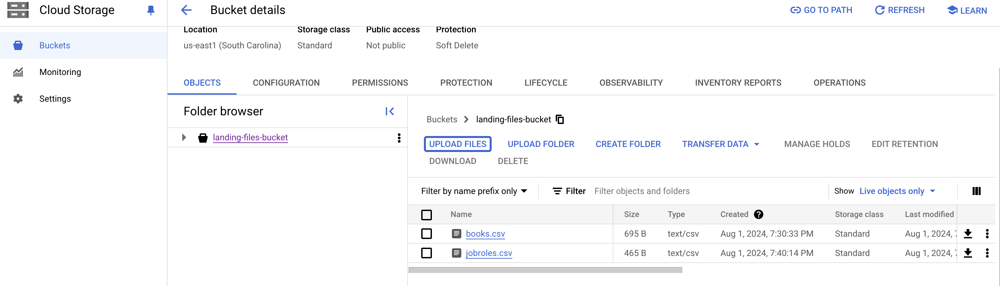

# Automate data upload to Bigquery 

## Introduction 
create a cloud function trigger to automatically create table and upload data to Bigquery

## Architecture 

## Process
- Upload data to gcs bucket

- cloud functon triggers
- creates Bigquery table with the required schema

- Trigger cloud function to upload data to bigquery
- Data is loaded to Bigquery

## Technology Used
- Programming Language - Python
- Google cloud platform
1. google cloud storage
2. Cloud function
3. Cloud run
4. Data flow
5. Bigquery

